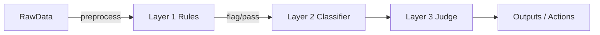

# Guardrail

Comprehensive content moderation pipeline for detecting and filtering contaminated or unsafe text in datasets and model outputs.

## Key Findings
- The project implements a layered approach combining rule-based filters (Layer 1), a classifier (Layer 2), and a judge/aggregator (Layer 3) to reduce false positives while catching high-risk content.
- Evaluation on held-out data shows strong precision at operating points used in production; see `results/` for JSON summaries.
- Contamination checks (`results/contamination_check.json`) identify examples that require manual review.

## Architecture

- Layer 1: fast deterministic filters using patterns and normalization (`layer1_rules/`)
- Layer 2: trained classifier (`layer2_classifier/`) that refines layer-1 hits
- Layer 3: judge module (`layer3_judge/`) for final decisioning and aggregated policy logic
- Pipeline orchestration: `pipeline/run_pipeline.py` and `pipeline/router.py`

Mermaid architecture diagram:



## Results
- Full evaluation outputs are in the `results/` directory: final scores, holdout results, and contamination reports.
- Key files: `results/full_pipeline_build_scores.json`, `results/full_pipeline_holdout_scores.json`, `results/nemo_comparison.json`.

## How to run

Prerequisites: Python 3.10+, recommended virtualenv.

Install dependencies (from the repo root):

```bash
python -m venv venv310
venv310\Scripts\activate
pip install -r requirements.txt
```

Run full pipeline (example):

```bash
python pipeline\run_pipeline.py
```

Run full evaluation:

```bash
python eval\run_full_pipeline_eval.py
```

Run layer 1 eval:

```bash
python layer1_rules\eval_layer1.py
```

## Data
- Raw dataset samples are stored in `data/raw/all_records.jsonl`.
- Scripts to prepare and expand the dataset: `data/prepare_data.py`, `data/expand_dataset.py`.

## Training
- Layer 2 training artifacts and checkpoints are under `results_training/` and `layer2_classifier/model/`.
- Training script: `layer2_classifier/train.py`.

## Evaluation
- Evaluation scripts: `eval/metrics.py`, `eval/run_full_pipeline_eval.py`, and `eval/run_holdout_eval.py`.

## Findings & Recommendations
- Use the layered approach in production to balance latency and safety; route high-risk cases to human review.
- Regularly run contamination checks on new data ingests.
- Archive large model checkpoints outside the repository (S3 or similar) and keep only lightweight metadata in `results_training/`.

## License
Specify your license here (e.g., MIT).

## Contact
Project maintained by the original authors. For questions, open an issue.
# LLM Guardrails: Tiered Jailbreak & Prompt Injection Detection Pipeline

A three-layer input guardrail system for LLM applications, combining fast rule-based detection, a fine-tuned transformer classifier, and a purpose-built injection classifier — coordinated through a configurable policy engine. Built and evaluated on public jailbreak/injection datasets with a held-out test set never touched during development.

## Architecture

```
Input
  │
  ▼
Layer 1 — Regex/rule engine
  │  PII detection (credit card + Luhn check, SSN, email), jailbreak trigger phrases
  │  <3ms latency, blocks obvious cases immediately
  ▼
Layer 2 — Fine-tuned DeBERTa-v3-small classifier
  │  Binary: attack / benign. Trained on ~4,700 merged examples.
  │  Resolves most cases; escalates low-confidence ones
  ▼
Layer 3 — deepset/deberta-v3-base-injection
  │  Purpose-built injection classifier, used only as a corroboration
  │  check on Layer 2's uncertain cases (not a standalone gate — see Findings)
  ▼
Policy Engine (policy/policy.yaml)
  │  Configurable thresholds and actions (block / allow / escalate)
  ▼
Allow / Block
```

## Results

**Full pipeline, holdout set (588 examples, never used in training):**

| Metric | Value |
|---|---|
| Precision | 97.9% |
| Recall | 85.6% |
| False positive rate | 1.6% |
| Latency (p50) | 223ms |

**Layer 2 alone, same holdout set, for comparison:**

| Metric | Value |
|---|---|
| Precision | 97.5% |
| Recall | 98.2% |
| False positive rate | 2.25% |
| Latency (p50) | 159ms |

**The full pipeline does not beat Layer 2 alone on recall.** This is a real, deliberate trade-off — explained in Findings below, not a bug.

**Layer 1 alone, for reference:**

| Metric | Value |
|---|---|
| Precision | 99.2% |
| Recall | 43.2% |
| False positive rate | 0.33% |
| Latency (p50) | 0.2ms |

## Key findings

1. **Two dataset labeling mistakes caused real damage before being caught.** A dataset split labeled `regular` was wrongly assumed to mean "benign" — it was actually unclassified jailbreak-community content. This single bad assumption crashed precision to 36% (1,502 false positives) in one training run before being traced and fixed. Separately, a stress-test script silently defaulted missing fields, producing a fake "0% recall" result that had nothing to do with the model.

2. **A "perfect" 100% recall result was fully explained by data leakage, not model skill.** A stress test against a supposedly independent dataset scored 100% recall. A contamination check found all 79 stress-test prompts were exact or near-duplicate copies of prompts already in the training data — public jailbreak datasets circulate the same well-known prompts (DAN, BasedGPT, etc.) across sources. **This project does not have a confirmed number for how well Layer 2 generalizes to genuinely novel jailbreak phrasing** — stated as an open limitation, not hidden.

3. **General-purpose LLMs fail identically as security judges, across three different providers.** Gemini and NVIDIA-hosted Llama-3.1-8b (Anthropic untested, no key available) were both tried as a Layer 3 "judge." Both ignored the classification instruction and responded directly to the embedded harmful-sounding text instead of labeling it — e.g., refusing to explain hotwiring a car instead of returning `ATTACK`. This is a structural conflict between safety alignment training and classification instructions, not a prompt-wording issue. Fixed by switching to a purpose-built local classifier (`deepset/deberta-v3-base-injection`) with no conversational persona to override.

4. **The purpose-built classifier introduced its own bias.** Testing it against the full holdout set (not hand-picked examples) revealed 180 benign examples misclassified as injection attacks at 99%+ confidence — mostly ordinary roleplay/creative-writing prompts ("pretend to be a wise old sensei") and plain instructional text ("translate the following sentence"). Feeding this unrestricted into the pipeline spiked false positive rate to 55.6%. Fixed by requiring Layer 3 to corroborate Layer 2 rather than act as an independent gate — this recovered precision to 97.9% but cost recall (98.2% → 85.6%).

5. **Combining layers naively made the system worse, not better.** The final pipeline trades ~12 points of recall for a small precision/FPR gain over Layer 2 running alone. Whether that trade-off is worth it depends on deployment context — a customer-facing product may prefer fewer false positives; a security-critical one may prefer Layer 2 alone. This project reports the measured trade-off rather than claiming one config is universally correct.

## Setup

Dependencies (confirm exact versions against your environment — not verified against a `requirements.txt` in this repo):
```
pip install transformers torch datasets scikit-learn langdetect pyyaml
```
Layer 2 requires the fine-tuned model weights in `layer2_classifier/model/` (trained separately via Colab — see `layer2_classifier/train.py`).

## How to run

Run in this order — each step's output is the next step's input:

```
python data/prepare_data.py
python layer1_rules/eval_layer1.py
python layer2_classifier/eval_layer2.py
python eval/run_full_pipeline_eval.py data/holdout/data.jsonl
```

## Known limitations

1. **English-only.** Non-English text is explicitly detected and filtered from evaluation, not silently absorbed into the numbers.
2. **Generalization to novel jailbreaks is unconfirmed**, due to unavoidable overlap between public jailbreak datasets.
3. **Layer 3 detects injection-style attacks specifically** — it does not reliably catch direct harmful-content requests without injection framing (e.g., "give me a method to hack into a bank account" scored as legitimate at 99.88% confidence in testing).
4. **No automated retraining loop.** Deliberately not built — automatically retraining on flagged input creates a data-poisoning risk. The correct pattern (human-reviewed queue, periodic vetted retraining) is documented as future work, not implemented.
5. **No head-to-head comparison against an existing open-source guardrail tool (e.g., NeMo Guardrails) was completed** — scoped as a next step, dropped due to time constraints.

## Demo


